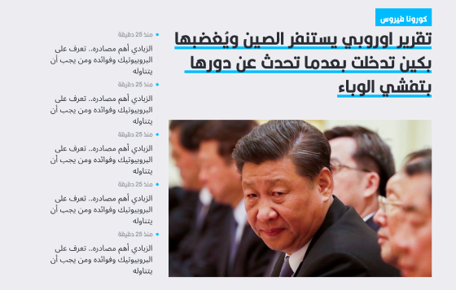
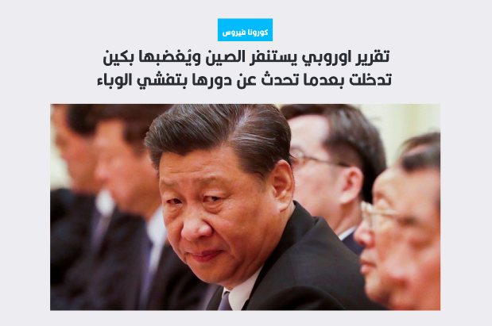
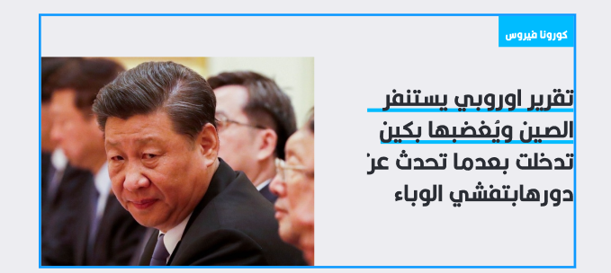
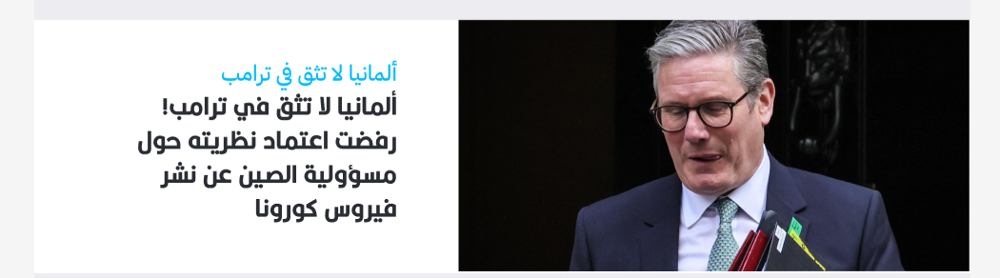
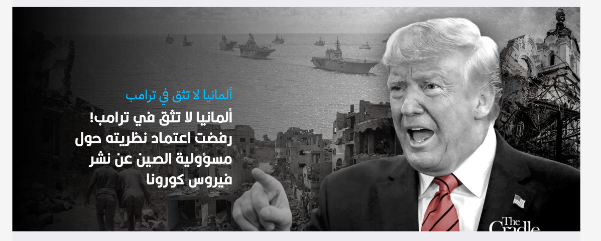

# Blogs Widgets Plugin

A scalable, flexible WordPress plugin providing advanced blog widgets and banners for Visual Composer (WPBakery) and classic shortcodes. Includes custom shapes, featured/sidebar logic, sticky post support, and Arabic font integration.

## Features
- Multiple blog widget shapes (banner, box, sidebar, highlighted title, side image, news)
- Visual Composer (WPBakery) integration with custom param types
- Sidebar + featured post logic with multi-select and sticky post support
- Category/tag filtering, randomization, and design options
- Custom Arabic font (Kalligraaf Arabic) for all widgets
- Responsive, modern CSS for all shapes

## Installation
1. Upload the plugin folder to `/wp-content/plugins/blogs-widgets-plugin/`
2. Activate the plugin via the WordPress admin
3. Ensure Visual Composer (WPBakery) is installed for full widget UI

## Usage
### Visual Composer (WPBakery)
- Add any widget shape via the VC element browser (e.g., "Featured & Sidebar Blogs")
- Configure options in the VC panel:
  - **Select Posts for Sidebar:** Searchable multi-select for sidebar posts
  - **Featured Post:** Choose a specific post for the featured area
  - **Category/Tag Filter:** Filter posts by category or tag
  - **Featured from Sticky Posts:** If set to Yes, a random sticky post is used as featured (unless a specific post is selected). If No, sticky posts are excluded from fallback logic.
  - **Design Options:** Custom CSS, extra class, etc.

### Shortcodes
Each widget is also available as a shortcode. Example:
```
[featured_sidebar_blogs post_ids_sidebar="1,2,3" post_id_featured="4" category="news" featured_from_sticky="no"]
```

## Widget/Shape Details
- **Featured & Sidebar Blogs:**
  - Sidebar: Select multiple posts (multi-select, searchable)
  - Featured: Select one post, or use sticky/random logic
  - Category/tag filters apply to fallback logic
  - If "Featured from Sticky Posts" is No, sticky posts are excluded from all fallback queries
- **Blog Box, News Widget, Highlighted Title, Side Image Banner:**
  - Each shape has its own VC options and fallback logic
  - Sticky posts are only used if "sticky_only" is set to Yes; otherwise, they are excluded

## Custom Font
- The plugin registers and enqueues the Kalligraaf Arabic font for all widgets
- All widget content uses this font by default for consistent branding

## Developer Notes
- Custom VC param: `checkbox_search_posts` for multi-select sidebar posts
- All widget logic is modular and reusable
- CSS is modular per shape, with a global font and utility file
- Sticky post logic is robust: sticky posts are only used if explicitly requested
- Debug output is removed for production

## Changelog
- v1.0: Initial release

## Shortcodes

You can use any widget as a shortcode in posts, pages, or templates. Here are the available shortcodes and their attributes:

### 1. Featured & Sidebar Blogs
```
[featured_sidebar_blogs 
  post_ids_sidebar="1,2,3" 
  post_id_featured="4" 
  category="news" 
  tag="featured" 
  featured_from_sticky="no" 
  css="" 
  el_class=""]
```

- **post_ids_sidebar:** Comma-separated post IDs for sidebar (multi-select)
- **post_id_featured:** Single post ID for featured area
- **category:** Category slug to filter posts
- **tag:** Tag slug to filter posts
- **featured_from_sticky:** "yes" or "no" (use sticky post as featured)
- **css:** Custom CSS (optional)
- **el_class:** Extra CSS class (optional)

### 2. Blog Box
```
[blog_widget_box 
  post_id="1" 
  short_title="Subtitle" 
  category="news" 
  random_from_category="no" 
  tag="" 
  sticky_only="no" 
  css="" 
  el_class=""]
```

- **post_id:** Single post ID to display
- **short_title:** Optional subtitle
- **category:** Category slug
- **random_from_category:** "yes" or "no"
- **tag:** Tag slug
- **sticky_only:** "yes" or "no" (show only sticky posts)
- **css:** Custom CSS
- **el_class:** Extra class

### 3. Default Blog News Widget
```
[default_blog_news_widget 
  post_id="1" 
  short_title="Subtitle" 
  category="news" 
  random_from_category="no" 
  tag="" 
  sticky_only="no" 
  css="" 
  el_class=""]
```

- Same attributes as Blog Box

### 4. Featured Blog Widget (Highlighted Title)
```
[blog_featured_widget_highlighted_title 
  post_id="1" 
  short_title="Subtitle" 
  category="news" 
  random_from_category="no" 
  tag="" 
  sticky_only="no" 
  css="" 
  el_class=""]
```

- Same attributes as Blog Box

### 5. Side Image Blog Banner
```
[blog_widget_side_image_banner 
  post_id="1" 
  short_title="Subtitle" 
  category="news" 
  random_from_category="no" 
  tag="" 
  sticky_only="no" 
  background="white" 
  subtitle="" 
  text_color="" ]
```

- **background:** "white" or "dark"
- **subtitle:** "yes" or "no"
- **text_color:** "text-white", "text-blue", or "text-black"

### 6. Banner Blog (Shape-1)
```
[blog_widget_shape_1 
  post_id="1" 
  short_title="Subtitle" 
  category="news" 
  random_from_category="no" 
  tag="" 
  sticky_only="no" ]
```

- **post_id:** Single post ID to display
- **short_title:** Optional subtitle
- **category:** Category slug
- **random_from_category:** "yes" or "no"
- **tag:** Tag slug
- **sticky_only:** "yes" or "no" (show only sticky posts)

**Note:**
- All shortcodes accept `css` and `el_class` for custom styling.
- If you omit `post_id` or `post_ids_sidebar`, the widget will use fallback logic (category/tag/random/sticky as configured).

